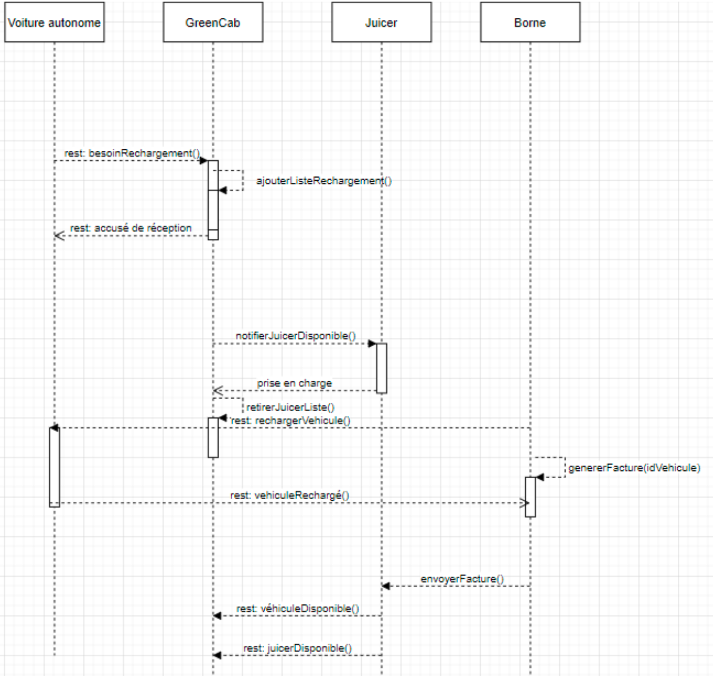
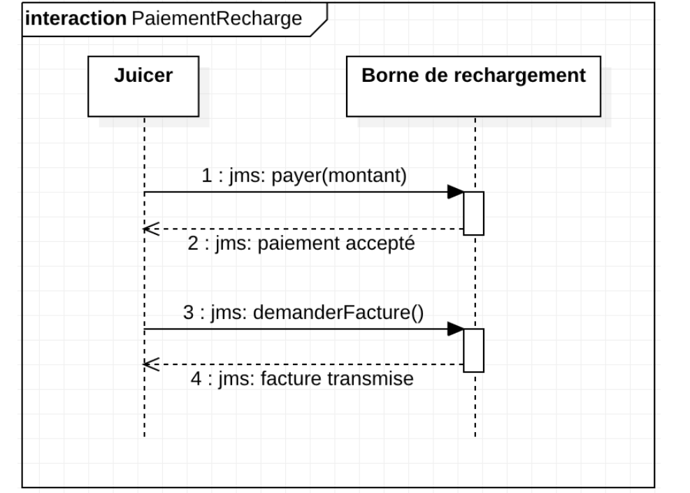
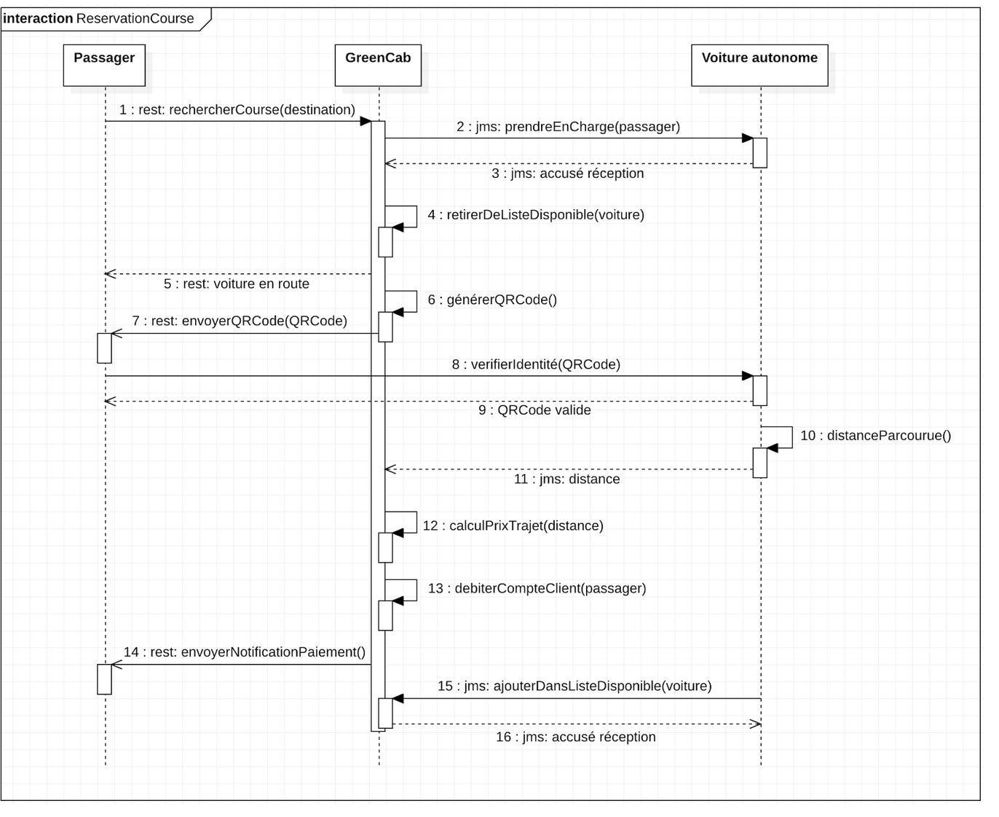
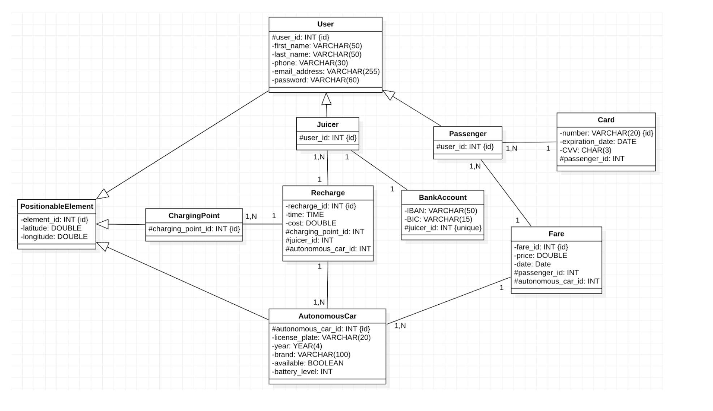

## Objectifs du système à modéliser

On souhaite modéliser un système qui met en relation des voitures autonomes et des passagers. Il doit permettre aux passagers de réserver une course pour une destination. Il doit permettre de détecter la présence de voitures disponibles à proximité du passager (dans un périmètre prédéfini) afin de lui attribuer une voiture. Le système doit également permettre aux voitures d’obtenir les informations de la course et du passager qui lui ont été attribués.

Le rôle du juicer est de récupérer les voitures déchargées pour les recharger dans des bornes de recharge.

Le rôle de la voiture est de sélectionner une course, de se rendre indisponible et de préciser l'endroit de la rencontre au passager. Si la voiture rencontre un problème lors du trajet, elle peut indiquer au passager le temps restant avant de l’atteindre. A la fin de la course, la voiture confirme sa disponibilité pour le prochain passager.

Le rôle du passager est de préciser les critères de sa course. Il doit renseigner sa destination ainsi que l’heure de dépôt. Il est ensuite automatiquement informé de l’arrivée de la voiture par l’application. Après vérification de son identité, il est pris en charge. À la fin de la course, le passager est débité de la somme calculée par le système (en fonction de la distance parcourue) pour la course.

## Interfaces

```
artist->master: POST venue
vendor->master: GET Gigs
master->vendor: Collection<Gigs>

Customer->vendor: cli:gig selection

vendor->master: jms:booking
alt booking successfull
    master->vendor: transitional tickets
    vendor->Customer: ticket purshase ok
    Customer->vendor: cli:customer informations
    
    vendor->master: jms:ticketing
    master->vendor: tickets

else booking unsuccessfull
    master->vendor: no quota for gigs
end

opt venue cancellation
    artist->master: DELETE venue
    master->vendor: jms:topic:cancellation
    vendor->Customer: smtp:cancellation email
end
```
## Diagrammes de séquence







## Schéma relationnel



## Exigences fonctionnelles

* Les voitures DOIVENT être pré-enregistrées dans le système.
* Les utilisateurs DOIVENT pouvoir supprimer leurs informations du système.
* Les utilisateurs DOIVENT pouvoir consulter l’historique de leurs courses (date, voiture, prix)
* Les utilisateurs DOIVENT pouvoir suivre leur course (implique de connaître la localisation de la voiture).
* Le passager DOIT pouvoir s’inscrire en indiquant son prénom, nom, téléphone, adresse e-mail et mot de passe.
* Le passager DOIT pouvoir commander une course en renseignant sa destination.
* La position du passager DOIT être connu par GreenCab.
* GreenCab DOIT informer le véhicule de la position du passager au moment de la commande (on admet ici que le passager ne se déplace pas en attendant).
* GreenCab doit alerter UNIQUEMENT les véhicules disponibles.
* Le véhicule DOIT informer le passager lorsqu’il arrive au point de rdv.
* Le système DOIT permettre au passager d’annuler sa course.
* GreenCab DOIT alerter le véhicule concerné en cas d’annulation.
* Le Juicer DOIT pouvoir renseigner ses informations bancaires.
* Le Passager DOIT pouvoir renseigner une ou plusieurs cartes bancaires.

## Exigences non fonctionnelles

* La localisation doit être fiable et utiliser le messaging.
* L’interface affichera la dernière localisation toutes les 30sec. Après 3 requêtes non abouties, on ne l’affiche plus.
* Lors de l’annulation d’une course, GreenCab DOIT informer le passager/voiture de façon fiable.

## Exigences bonus

* Si une voiture présente une défaillance, elle DOIT être indisponible le temps des réparations.
* Les voitures qui doivent être rechargées DOIVENT uniquement notifier les juicers à proximité (implique de connaître leur localisation).
