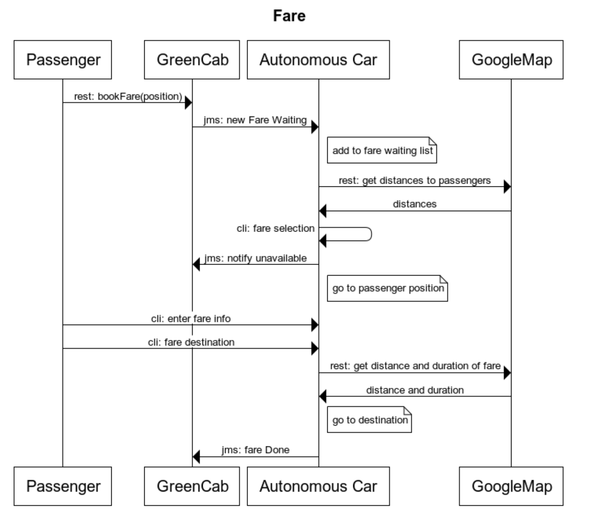
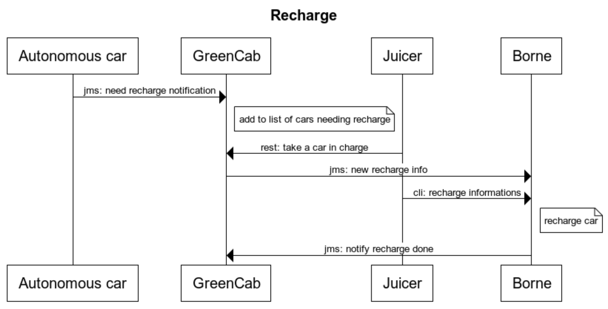
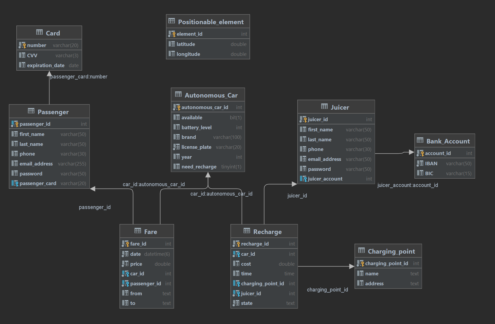
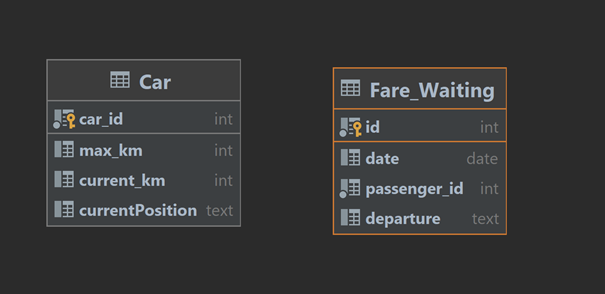
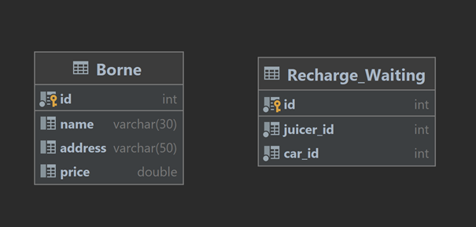

## Objectifs du système à modéliser

On souhaite modéliser un système qui met en relation des voitures autonomes et des passagers. Il doit permettre aux passagers de réserver une course pour une destination. Le système doit permettre aux voitures d’obtenir les informations de la course et du passager qui lui ont été attribués.

Le rôle du juicer est de récupérer les voitures déchargées pour les recharger dans des bornes de recharge.

Le rôle de la voiture est de sélectionner une course, de récupérer le passager et l'emmener vers sa destination. Si la voiture rencontre un problème lors du trajet, elle peut indiquer au passager le temps restant avant de l’atteindre. A la fin de la course, la voiture confirme sa disponibilité pour le prochain passager.

Le rôle du passager est de préciser les critères de sa course. Il doit renseigner sa destination ainsi que l’heure de dépôt. Il est ensuite automatiquement informé de l’arrivée de la voiture par l’application. Après vérification de son identité, il est pris en charge. À la fin de la course, le passager est débité de la somme calculée par le système (en fonction de la distance parcourue) pour la course.

## Diagrammes de séquence

## Schémas relationnels

GreenCab DB :

Voiture DB :

Borne DB :

## Exigences fonctionnelles

* Les voitures DOIVENT être pré-enregistrées dans le système.
* Les utilisateurs DOIVENT pouvoir supprimer leurs informations du système.
* Les utilisateurs DOIVENT pouvoir consulter l’historique de leurs courses (date, voiture, prix)
* Le passager DOIT pouvoir s’inscrire en indiquant son prénom, nom, téléphone, adresse e-mail et mot de passe.
* Le passager DOIT pouvoir commander une course en renseignant sa position actuelle.
* Le passager DOIT renseigner sa destination une fois dans le véhicule.
* GreenCab DOIT informer le véhicule de la position du passager au moment de la commande (on admet ici que le passager ne se déplace pas en attendant).
* GreenCab doit alerter UNIQUEMENT les véhicules disponibles.
* Le Juicer DOIT pouvoir renseigner ses informations bancaires.
* Le Passager DOIT pouvoir renseigner une carte bancaire.

## Exigences non fonctionnelles

* La localisation doit être fiable et utiliser le messaging.
* Lors de l’annulation d’une course, GreenCab DOIT informer le passager/voiture de façon fiable.

## Exigences bonus

* Le système DOIT permettre au passager d’annuler sa course.
* * GreenCab DOIT alerter le véhicule concerné en cas d’annulation.
* Si une voiture présente une défaillance, elle DOIT être indisponible le temps des réparations.
* L’interface affichera la dernière localisation toutes les 30sec. Après 3 requêtes non abouties, on ne l’affiche plus.
* Les voitures qui doivent être rechargées DOIVENT uniquement notifier les juicers à proximité (implique de connaître leur localisation).
* Les utilisateurs DOIVENT pouvoir suivre leur course (implique de connaître la localisation de la voiture).